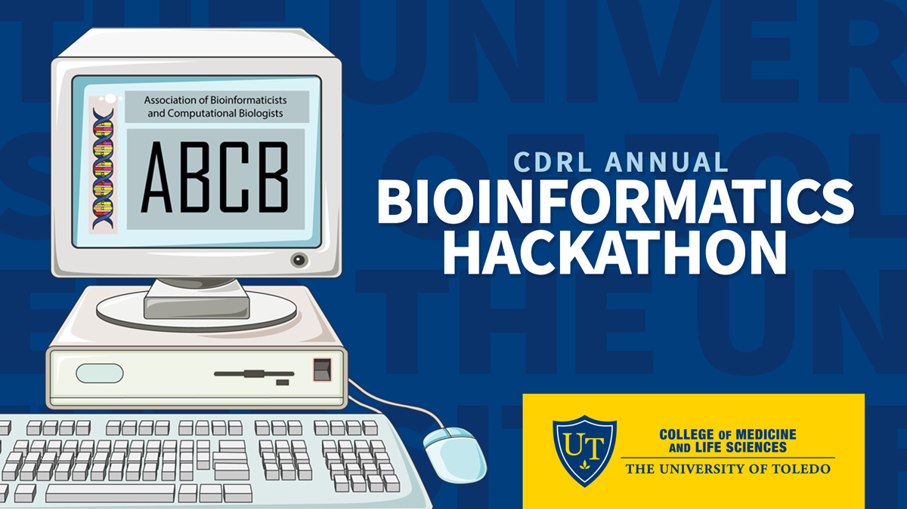

The CDRL Annual Bioinformatics Hackathon is an event that brings the
best and brightest together to focus on solving a standing problem in
Bioinformatics. This competition aims to ignite people’s imaginations
and to spur them into action utilizing both older and modern techniques.

**The 2021 Bioinformatics Hackathon will take place** ***April 14-16***.
The theme of this hackathon is “**Mine this Dataset**”

### Timeline:

-   Last Date to Register: Sunday, April 4th, 2021. [Register
    Here](https://forms.gle/YNQw9bDaLMjTJ8yb7)

-   Dataset Reveal: 8 AM, April 14th, 2021

-   Inaugural Session: 10 AM, April 14th, 2021

-   First Impressions Session: 3 PM, April 14th, 2021

-   Progress Check In: 12 PM, April 15th, 2021

-   Final Presentations: 2 PM, April 16th, 2021

### Guidelines:

-   Teams should consist of 2-4 players

-   No swapping of teammates will be allowed

-   Each team will be provided with a dedicated set of tools in a remote
    high performance cluster environment. No other computing resources
    will be allowed

-   Any tools or scripts developed in the process should be released
    under an open-source compatible license

### Judges:

-   Dr. Robert E. McCullumsmith

-   Dr. Jarek Meller

-   Dr. Rammohan Shukla

-   Dr. Sinead O’Donovan

### Prizes

-   First Prize: $500 and a plaque

-   Second Prize: $300 and a plaque

-   Third Prize: $100 and a certificate

-   Honorable Mentions: A certificate

*Every team that participates will get a certificate of participation.*
