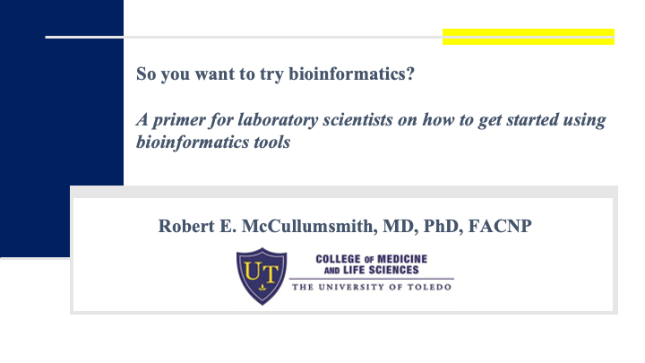
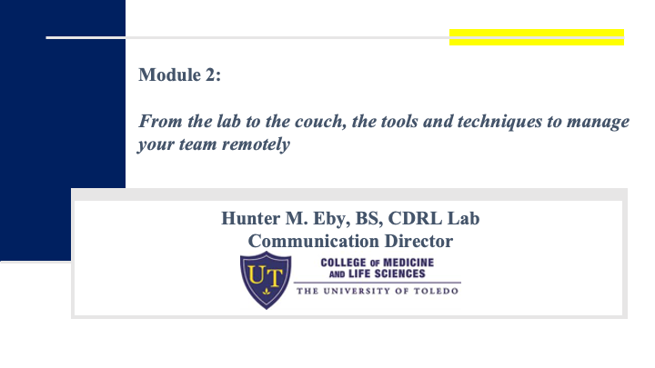
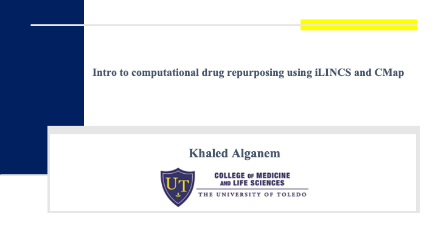
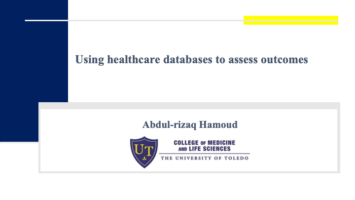

&nbsp;
&nbsp;
&nbsp;
&nbsp;
&nbsp;
&nbsp;
# About

**Title**: CDRL Spring 2020 Webinar Series  
**Summary**:  CDRL Spring 2020 Webinar Series  
**Date**: from 4/1/2020  to 4/27/2020  
**Presenters**: [Dr. Robert Mccullumsmith](/authors/rob), [Dr. Rammohan Shukla](/authors/ram), [Khaled Alganem](/authors/khaled), [Ali Imami](/authors/ali), [Hunter Eby](/authors/hunter), [Abdul-rizaq Hamoud](/authors/abdul), [Nicholas Henkel](/authors/nick)

&nbsp;
&nbsp;
&nbsp;
&nbsp;
&nbsp;
&nbsp;

# Talks:  

Title: **So you want to try Bioinformatics: A primer for laboratory scientists on how to get started using bioinformatics tools**  
Date: 4/1/2020  
Presenter: [Dr. Robert Mccullumsmith](/authors/rob)

Video: [Link](https://utoledo.webex.com/utoledo/lsr.php?RCID=f6724f1e6e33436cd8231af579642d3d)  
Slides: [Link](https://onedrive.live.com/view.aspx?resid=1DF657364709EA78!3399&ithint=file%2cpptx&authkey=!AAeLpf9fKYydi_c) 

*** 
&nbsp;
&nbsp;
&nbsp;
&nbsp;
&nbsp;
&nbsp;

Title: **From the lab to the couch, the tools and techniques to manage your team remotely** 
Date: 4/3/2020  
Presenter: [Hunter Eby](/authors/hunter)

Video: [Link](https://utoledo.webex.com/utoledo/lsr.php?RCID=b3611d6f1f961b0348ccce06ae6868a3)  
Slides: [Link](https://1drv.ms/p/s!AnjqCUc2V_YdmkgFYiAz1X9hea6U) 

***

&nbsp;
&nbsp;
&nbsp;
&nbsp;
&nbsp;
&nbsp;

Title: **Demystifying R: An introduction to R and RStudio** 
Date: 4/6/2020  
Presenter: [Ali Imami](/authors/ali)

Video: [Link](https://utoledo.webex.com/utoledo/lsr.php?RCID=7ebd5d740a8579934de2b2a91b568b60)  
Slides: [Link](https://1drv.ms/p/s!AnjqCUc2V_YdmknnyBEwsou_U5Y0) 

***

&nbsp;
&nbsp;
&nbsp;
&nbsp;
&nbsp;
&nbsp;

Title: **Bioinformaticist's Aresenal: A gentle introduction to Bioconductor**  
Date: 4/8/2020  
Presenter: [Ali Imami](/authors/ali)

Video: [Link](https://utoledo.webex.com/utoledo/lsr.php?RCID=b3b6d3d68dca3098e90973e388ccbc83)  
Slides: [Link](https://1drv.ms/p/s!AnjqCUc2V_YdmkrH3g4j7EBu_fyL) 

***

&nbsp;
&nbsp;
&nbsp;
&nbsp;
&nbsp;
&nbsp;

Title: **Kaleidoscope: A new Bioinformatics Pipeline Web Application for In Silico Hypothesis Exploration**  
Date: 4/10/2020  
Presenter: [Khaled Alganem](/authors/khaled)

Video: [Link](https://utoledo.webex.com/utoledo/lsr.php?RCID=deb5d58bff8923240941ceb45a727108)  
Slides: [Link](https://utoledo.webex.com/utoledo/lsr.php?RCID=deb5d58bff8923240941ceb45a727108) 

***

&nbsp;
&nbsp;
&nbsp;
&nbsp;
&nbsp;
&nbsp;

Title: **Intro to computation drug repurposing using iLINCS and CMap**  
Date: 4/13/2020  
Presenter: [Dr. Rammohan Shukla](/authors/ram), [Khaled Alganem](/authors/ram)

Video: [Link](https://utoledo.webex.com/utoledo/lsr.php?RCID=0f1cb7504d90bff1b31d07a92c157199)  
Slides: [Link](https://utoledo.webex.com/utoledo/lsr.php?RCID=0f1cb7504d90bff1b31d07a92c157199) 

***

&nbsp;
&nbsp;
&nbsp;
&nbsp;
&nbsp;
&nbsp;

Title: **SEQing the future: An introduction to RNASeq**  
Date: 4/15/2020  
Presenter: [Ali Imami](/authors/ali)

Video: [Link](https://utoledo.webex.com/utoledo/lsr.php?RCID=8181108b0c995f1d560802de625a1c39)  
Slides: [Link](https://1drv.ms/p/s!AnjqCUc2V_Ydmkv3ivch3iGMZbHJ) 

***

&nbsp;
&nbsp;
&nbsp;
&nbsp;
&nbsp;
&nbsp;

Title: **Introduction to Citation Management**  
Date: 4/17/2020  
Presenter: Ryan Homan

Video: [Link](https://utoledo.webex.com/utoledo/lsr.php?RCID=54fe16117c34c0cfbb2eb65ae4a1397d)  
Slides: [Link](https://1drv.ms/p/s!AnjqCUc2V_YdmkxUmZFSwvd7jI71) 

***

&nbsp;
&nbsp;
&nbsp;
&nbsp;
&nbsp;
&nbsp;

Title: **Adobe Illustrator Basics**  
Date: 4/20/2020  
Presenter: Ryan Homan, [Nicholas Henkel](/authors/nick)

Video: [Link](https://utoledo.webex.com/utoledo/lsr.php?RCID=980a27018d673ed3b39d81d767e13901)  
Slides: [Link](https://1drv.ms/p/s!AnjqCUc2V_Ydmk24Yn1OTG7tGDti) 

***

&nbsp;
&nbsp;
&nbsp;
&nbsp;
&nbsp;
&nbsp;

Title: **Using Healthcare Databases to Assess Outcomes**  
Date: 4/27/2020  
Presenter: [Abdul Hamoud](/authors/abdul)

Video: [Link](https://drive.google.com/file/d/1ZdlBVrnf_rcA-d38mKOmjZTXmLdPcTrq/view)  
Slides: [Link](https://1drv.ms/p/s!AnjqCUc2V_Ydmk7WhsZYPmIU6HOh) 

